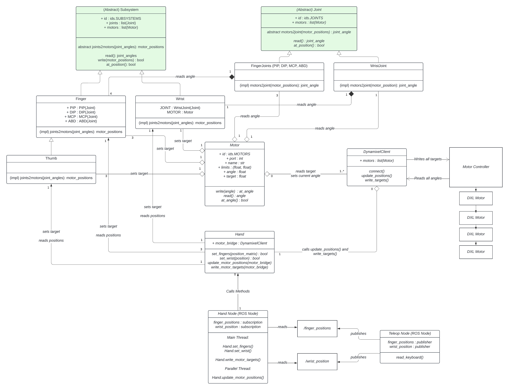

# Architecture



# Setup

### We are using ROS 2 Humble, for Ubuntu Jammy 22.04
 - Install and configure git
    ```
    sudo apt-get install git
    git config --global user.name GITHUB_USERNAME
    git config --global user.email GITHUB_EMAIL
    ```

 - Install **ROS 2**
    - https://docs.ros.org/en/humble/Installation/Ubuntu-Install-Debs.html

 - Add ROS to bash
   - ```nano ~/.bashrc```

      At the bottom add

      ```
      source /opt/ros/humble/setup.bash
      source ~/ros2_ws/install/setup.bash
      ```

      Restart the command line window to apply the .bashrc

 - Install **Colcon** and **Ninja** for building
    - ```
      sudo apt install python3-colcon-common-extensions
      sudo apt-get install ninja-build
      ```

 - Install **rosdep** for dependency management
   - ```
      sudo apt-get install python3-rosdep
      sudo rosdep init
      sudo rosdep update
      ```
 - Create a **ros2 workspace** at home and go to its **src** folder
    - ```
        mkdir -p ~/ros2_ws/src
        cd ~/ros2_ws/src
        ```
- Clone this repository
   - ```git clone https://github.com/Esteb37/dextrous_hand```

- Resolve dependencies
  - ```
      cd ..
      rosdep install -i --from-path src --rosdistro humble -y
      ```
 - Build from within ```ros2_ws```
   - ```colcon build --packages-select dextrous_hand```

 - Test node
   - ```ros2 run dextrous_hand basic_node```

         [INFO] [1728219147.878266379] [basic_node]: Hello, ROS 2 (Python)!

 - Add pip
   - ```sudo apt install python3-pip```

 - Add Motor library
   - ```
      cd
      git clone https://github.com/ROBOTIS-GIT/DynamixelSDK.git
      cd DynamixelSDK/python
      sudo python3 setup.py install
   ```

 - Add teleop control library
   - ```pip install pynput```

# Running Teleop Control

- ```cd``` to your ```ros2_ws``` workspace
- ```colcon build```
- Connect the motor controller
- Give access to the port

   ```sudo chmod 777 /dev/ttyUSB0```
   or
   ```sudo chmod 777 /dev/ttyUSB1```

- Run hand node
   ```ros2 run dextrous_hand hand_node```
   Make sure all motors show as connected
- In another window run teleop node
   ```ros2 run dextrous_hand teleop_node```

- Control the motors with the keyboard
   - Select predefined configuration
      ```
      z = Home
      x = Grasp
      c = Rock
      v = Middle finger
      b = Peace sign
      n = Thumbs up
      m = Spock salute
      ```
   - Select the subsystem
      ```
      q = pinky
      w = ring
      e = middle
      r = index
      t = thumb
      y = wrist
      u = all fingers (no wrist)
      o = orientation
      p = position
      ```
   - Select the joint
      ```
      1 = ABD | wrist | position X | orientation roll
      2 = MCP | position Y | orientation pitch
      3 = PIP/DIP | position Z | orientation yaw
      ```

   - Control the joint
      ```
      l = add to angle
      k = substract from angle
      ```

# Calibration
   - Set all the fingers and wrist to the desired zero position
   - Run ```calibration_node```
   - If motor direction also needs to be calibrated
      - Select ```y``` when prompted
      - Flex all the finger joints towards the inside of the palm and the wrist forward.
      - Press ```enter```

# Adding files

## Nodes
- Add the **.py** file at **/src**
- In setup.py
   ```
    entry_points={
        'console_scripts': [
            'basic_node = src.basic_node:main',
            'your_node = src.your_node:main', <-- Add node here
        ],
    },
   ```
## Modules
- Just add the **.py** file at **/dextrous_hand**
   - When importing, do not forget to append ```dextrous_hand```

      ```import dextrous_hand.my_module as my_module```

# File Structure
 - **/src** - Python node files
 - **/dextrous_hand** - Python module files
 - **/launch** - ROS Launch files
 - **/test** - Any code that does not correspond to a node (i.e. test code and experiments)
 - **/data** - Images, text-files, ML models etc


# Building With Symlink
 - Open your bashrc and add ```alias colcon_build='colcon build --symlink-install'```
 - source bashrc
 - Now you can build once with colcon_build.
 - Build everytime you add a new file.
 - No need to rebuild for every change made in a Python file.
 - Need to rebuild for every change made in a C++ file.
# SetupTools Error
 - If you have the setup tools error, do the following in a new terminal:```pip list | grep setuptools```
 - You should see that your setuptools version is > 58.2.0
 - Downgrade the version : ```pip install --upgrade pip setuptools==58.2.0```
 - ```pip list | grep setuptools``` to check if downgrade successfull
 - You should not have this error again
